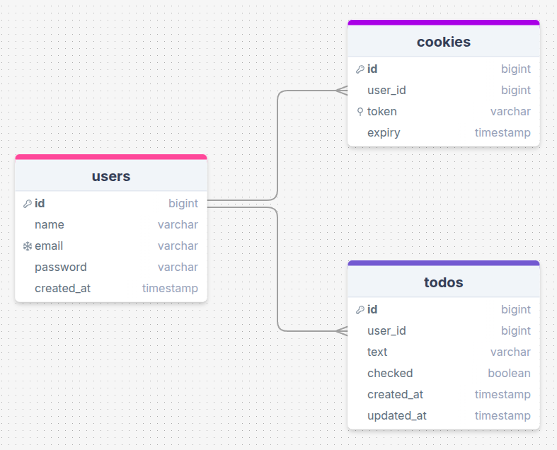

# Documentazione dell'Architettura Tecnica

Questo documento descrive la struttura interna dell'applicazione web Todo in PHP utilizzando diagrammi UML delle classi e diagrammi relazionali del database. Serve come riferimento per i modelli dell'applicazione, i DTO, i repository e le loro relazioni.

## Schema del Database

Il database è composto da tre tabelle principali:

### `users`

- `id`: bigint (PK)
- `name`: varchar
- `email`: varchar (unico)
- `password`: varchar
- `created_at`: timestamp

### `todos`

- `id`: bigint (PK)
- `user_id`: bigint (FK → users.id)
- `text`: varchar
- `checked`: boolean
- `created_at`: timestamp
- `updated_at`: timestamp

### `cookies`

- `id`: bigint (PK)
- `user_id`: bigint (FK → users.id)
- `token`: varchar (unico)
- `expiry`: timestamp

## Struttura delle Classi

Le classi sono raggruppate per responsabilità nei seguenti livelli:

### 1. Models

Rappresentano le entità principali del dominio.

- **User**
  - `int id`
  - `string name`
  - `string email`
  - `static fromArray(array): User`

- **PasswordUser** (estende `User`)
  - `string password`
  - `static fromArray(array): PasswordUser`

- **Todo**
  - `int id`
  - `int user_id`
  - `string text`
  - `bool checked`
  - `DateTime created_at`
  - `DateTime updated_at`
  - `static fromArray(array): Todo`

- **Cookie**
  - `int id`
  - `int user_id`
  - `string token`
  - `DateTime expiry`
  - `static fromArray(array): Cookie`

### 2. **DTOs (Data Transfer Objects)**

Utilizzati per passare dati validati ai metodi dei repository.

- **CreateUserDTO**
  - `string name`
  - `string email`
  - `string password`
  - `hashPassword(): void`

- **LogInUserDTO**
  - `string email`
  - `string password`
  - `verify(hashedPassword: string): bool`

- **CreateTodoDTO**
  - `string user_id`
  - `string text`

- **UpdateTodoDTO**
  - `string text`
  - `string checked`

- **CreateCookieDTO**
  - `string user_id`
  - `string token`
  - `string expiry`

### 3. **Repositories**

Gestiscono le interazioni con il database.

- **UserRepository**
  - `findById(id: int): User`
  - `findByEmail(email: string): PasswordUser`
  - `insertOne(user: CreateUserDTO): bool`

- **TodoRepository**
  - `findById(id: int): Todo`
  - `findAllByUserId(id: int): Todo[]`
  - `insertOne(todo: CreateTodoDTO): bool`
  - `updateOne(id: int, todo: UpdateTodoDTO): bool`
  - `deleteOne(id: int): bool`

- **CookieRepository**
  - `findByToken(token: string): Cookie`
  - `insertOne(cookie: CreateCookieDTO): bool`
  - `deleteByToken(token: string): bool`
