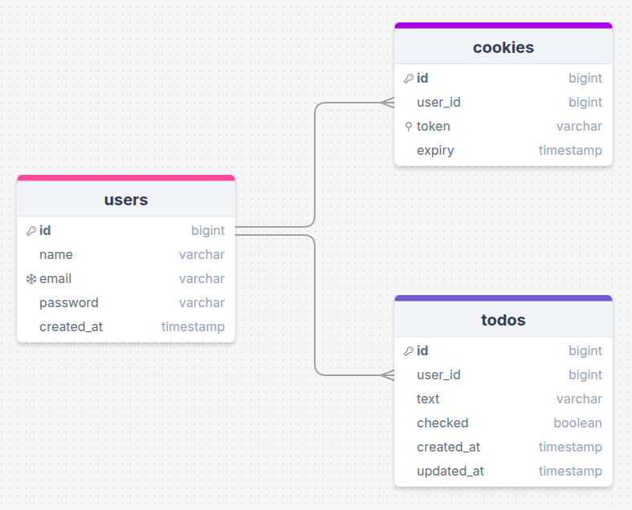
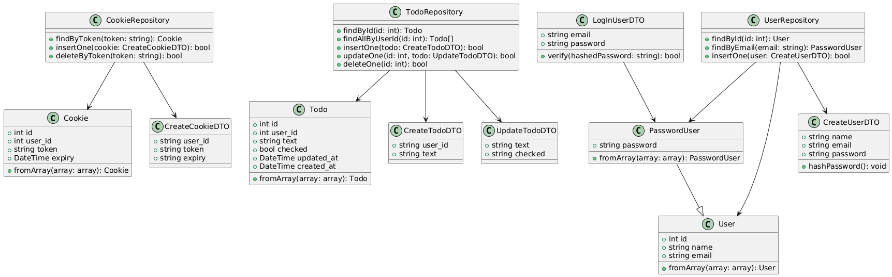

# Technical Architecture Documentation

This document outlines the internal structure of the PHP Todo web application using UML class design and relational database diagrams. It serves as a reference for the application's models, DTOs, repositories, and their relationships.

## Database Schema

The database consists of three main tables:

### `users`

- `id`: bigint (PK)
- `name`: varchar
- `email`: varchar (unique)
- `password`: varchar
- `created_at`: timestamp

### `todos`

- `id`: bigint (PK)
- `user_id`: bigint (FK → users.id)
- `text`: varchar
- `checked`: boolean
- `created_at`: timestamp
- `updated_at`: timestamp

### `cookies`

- `id`: bigint (PK)
- `user_id`: bigint (FK → users.id)
- `token`: varchar (unique)
- `expiry`: timestamp

## Class Structure

Classes are grouped by responsibility into the following layers:

### 1. Models

These represent core domain entities.

- **User**
  - `int id`
  - `string name`
  - `string email`
  - `static fromArray(array): User`

- **PasswordUser** (extends `User`)
  - `string password`
  - `static fromArray(array): PasswordUser`

- **Todo**
  - `int id`
  - `int user_id`
  - `string text`
  - `bool checked`
  - `DateTime created_at`
  - `DateTime updated_at`
  - `static fromArray(array): Todo`

- **Cookie**
  - `int id`
  - `int user_id`
  - `string token`
  - `DateTime expiry`
  - `static fromArray(array): Cookie`

### 2. **DTOs (Data Transfer Objects)**

Used to pass validated data into repository methods.

- **CreateUserDTO**
  - `string name`
  - `string email`
  - `string password`
  - `hashPassword(): void`

- **LogInUserDTO**
  - `string email`
  - `string password`
  - `verify(hashedPassword: string): bool`

- **CreateTodoDTO**
  - `string user_id`
  - `string text`

- **UpdateTodoDTO**
  - `string text`
  - `string checked`

- **CreateCookieDTO**
  - `string user_id`
  - `string token`
  - `string expiry`

### 3. **Repositories**

They manage interactions with the database.

- **UserRepository**
  - `findById(id: int): User`
  - `findByEmail(email: string): PasswordUser`
  - `insertOne(user: CreateUserDTO): bool`

- **TodoRepository**
  - `findById(id: int): Todo`
  - `findAllByUserId(id: int): Todo[]`
  - `insertOne(todo: CreateTodoDTO): bool`
  - `updateOne(id: int, todo: UpdateTodoDTO): bool`
  - `deleteOne(id: int): bool`

- **CookieRepository**
  - `findByToken(token: string): Cookie`
  - `insertOne(cookie: CreateCookieDTO): bool`
  - `deleteByToken(token: string): bool`
